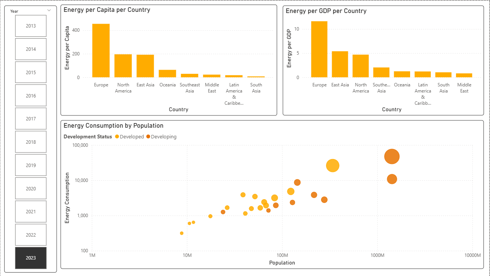
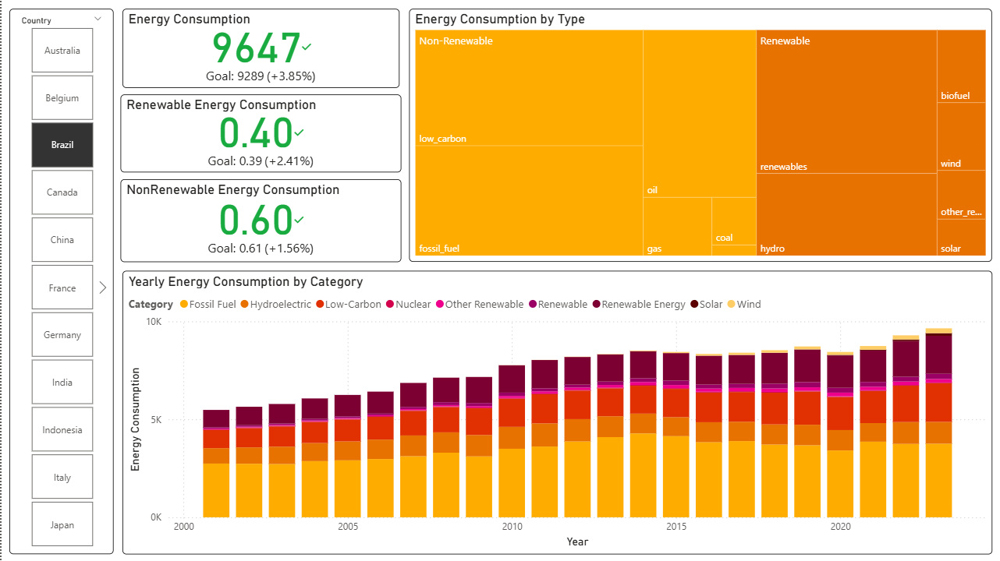

# Energy Data Analysis – Global Energy ETL & Insights Project
## Project Summary

This project builds an end-to-end ETL pipeline to extract, clean, transform, and model global energy consumption and production data, enabling analytical insights on worldwide energy trends, renewable adoption, economic dependency, and geopolitical impacts.

Objective

Analyze global energy consumption patterns and renewable energy transitions over time to answer key questions such as:

How is energy consumption evolving worldwide?

Are countries transitioning to renewable sources?

Which economies are the biggest consumers and producers?

Is energy usage correlated with GDP and population growth?

## Main Goal

Provide decision-grade insights on worldwide energy evolution, focusing on consumption, demand, competitiveness, and sustainability.

## Architecture Overview

Architecture Type: ETL (Extract → Transform → Load → Analytics)

     +--------------------------+
     |   Our World in Data CSV  |
     +-------------+------------+
                   |
                   ▼
        +----------------------+
        | Extract (Python)     |
        +----------------------+
                   |
                   ▼
        +----------------------+
        | Transform (Pandas)   |
        | - Cleaning           |
        | - Feature Engineering|
        | - Dimensional Model  |
        +----------------------+
                   |
                   ▼
        +----------------------+
        |   Dimensional Data   |
        +----------------------+
                   |
                   ▼
        +----------------------+
        |   Power BI Analytics |
        | Dashboards & KPIs    |
        +----------------------+

## Tech Stack
Layer	Tools
Extraction & Cleaning	Python, Pandas
Modeling	Dimensional approach (Star Schema)
Storage	Local tabular storage (CSV/Parquet)
BI & Analytics	Microsoft Power BI

## Data Source

Dataset: Our World in Data – Global Energy Dataset
Contains historical energy indicators such as:

Different Energy Sources Production and Consumption ( fossiel fuel, hydro, nuclear, etc)

Total Energy Consumption

Total Electricity Demand and Production

Country Details ( population, gdp, iso_code)

more details in owid-energy-codebook.csv

## Dashboard Preview

### Dashboard Page 1 — Global Consumption Trends

Energy per capita over time

Energy per GDP over time

Top 10 consuming countries (bar / line combo)

Fossil vs renewable evolution (stacked area)

### Dashboard Page 2 — Detailed View

Renewable share by continent

Top adopters vs lagging nations

Forecast or projection (optional)

Correlation between GDP growth & renewable transition

## Key Insights & Hypotheses
### Renewable Energy Adoption

Global renewable adoption is steadily increasing, driven mainly by EU and some South American countries.

Developed countries are still heavily dependent on non-renewable sources, despite having financial and technological capacity for transition.

Brazil, Sweden, and France stand out as strong renewable adopters.

###s Global Energy Competitiveness

USA, China, and India show the strongest competition in total energy consumption due to industrial expansion, population, and economic intensity.

Emerging economies mirror increasing energy demand patterns similar to historic Western industrialization, while developped countries show small fluctuation of energy demande.
